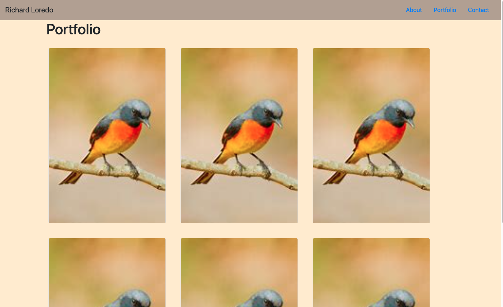

# Responsive Portfolio

In this assignment I built a responsive web portfolio using Bootstrap Frameworks and semantic HTML. It contains a navbar with three links to each seperate html file. My name is in the top left of the navBar and the colors are universal among all of the html files.

## Screenshot 

### Link to Deployed Webpage

https://anthonyloredo5.github.io/Hw-02/\